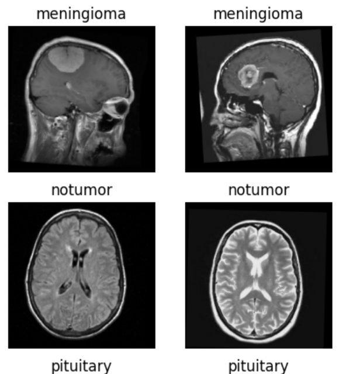
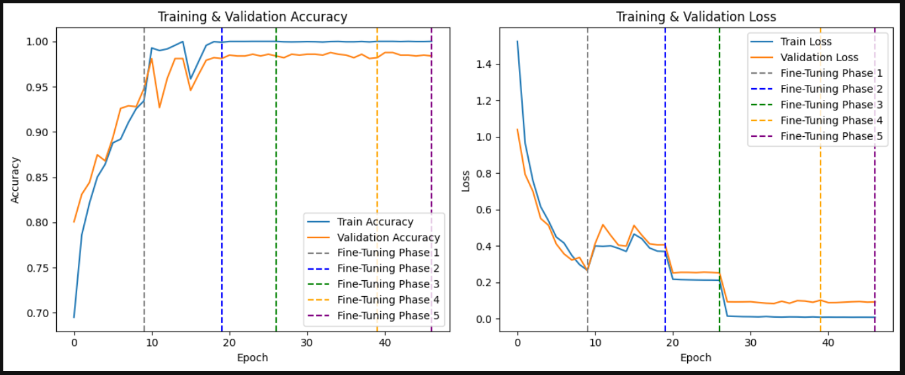

# Deep Learning-Based Brain Tumor Classification from MRI: An AI-Assisted Diagnostic Approach

## 🎯 Project Overview

This project aims to develop a robust, interpretable, and highly accurate AI-based diagnostic tool for classifying brain tumors from MRI images. Leveraging both custom convolutional neural networks (CNNs) and advanced transfer learning architectures such as **ResNet-50**, **EfficientNetB0**, and **DenseNet-121**, the system classifies MRI scans into four tumor categories: **glioma**, **meningioma**, **pituitary**, and **no tumor**.

> I completed this project when taking the Teesside Deep Learning module.

---

## 📌 Aims and Motivation

- **Reduce diagnostic errors** and support faster, automated detection of brain tumors.
- **Promote clinical trust** through explainability (Grad-CAM) and performance stability.
- **Bridge healthcare gaps** in underserved regions by supporting scalable AI solutions.
- Address **social, ethical, and legal concerns** of AI in medicine, including:
  - Misinterpretation of AI outputs by clinicians and legal accountability.
  - Overreliance on AI leading to erosion of critical medical thinking.
  - Dataset bias affecting minority populations (e.g., ethnicity, gender).
  - Inequality in AI access across countries and healthcare systems.
  - Data privacy concerns from fast-paced AI deployment.

---

## 🧠 Models Implemented

### 1. **Custom CNN Model**
- Built from scratch using convolutional, pooling, and dropout layers.
- Activation functions tuned (Swish, LeakyReLU) for better convergence.
- Baseline performance established before transfer learning implementation.

### 2. **Transfer Learning Models**
- **ResNet-50**, **EfficientNetB0**, **DenseNet-121**
- Pre-trained on ImageNet; top layers fine-tuned for binary/multiclass tumor classification.
- Fine-tuning strategies:
  - Layer unfreezing and re-training higher layers.
  - Learning rate optimization (`1e-4` to `1e-6`).
  - Increased batch size (32 → 64).
  - Dropout and `EarlyStopping` to reduce overfitting.

### 3. **Evaluation and Interpretability**
- Metrics used: **Accuracy**, **Precision**, **Recall**, **F1-Score**
- Model explainability via **Grad-CAM** heatmaps to localize tumor regions.
- Frameworks: **TensorFlow** and **Keras**

---

## 🧪 Dataset and Preprocessing

- 📂 **Source**: [Kaggle Brain Tumor MRI Dataset](https://www.kaggle.com/datasets/masoudnickparvar/brain-tumor-mri-dataset)
- 🖼️ 7,022 pre-labeled MRI images across 4 classes: *glioma, meningioma, pituitary, no tumor*.
- Images resized to `224x224x3`, padded for aspect ratio preservation.
- Additional 20-pixel padding applied to reduce corner feature loss (Chaudhary, 2022).
- Augmented using **ImageDataGenerator** with minor zoom, flip, and rotation for realism.

---

## 📊 Results & Findings

| Model           | Accuracy | Precision | Recall | F1-Score | Notes                                 |
|----------------|----------|-----------|--------|----------|---------------------------------------|
| **EfficientNetB0** | 99.05%   | 98.99%    | 99.00% | 99.00%   | Best overall performance              |
| **DenseNet-121**  | 99.05%   | 98.80%    | 98.95% | 98.85%   | Highest validation accuracy, slower   |
| **ResNet-50**     | 98.86%   | 98.80%    | 98.85% | 98.82%   | Consistently strong, moderate time    |
| **Custom CNN**    | 98.01%   | 97.90%    | 97.85% | 97.87%   | Baseline model after fine-tuning      |

---

## 📈 Visualizations

- **Training vs. Validation Curves** (Accuracy & Loss)
- **Grad-CAM Heatmaps** for tumor localization
- **Confusion Matrices** for each model

_Example:_

---

## 🔬 Ethical, Social & Legal Considerations

| Risk Area                          | Description                                                                                  | Mitigation Strategy                                   |
|-----------------------------------|----------------------------------------------------------------------------------------------|-------------------------------------------------------|
| **AI Misinterpretation**          | Potential misdiagnoses if AI results are used without context                                | Transparency, human-in-the-loop review                |
| **Overreliance on AI**            | Erosion of clinical judgment                                                                  | Retain standard medical practices, retraining programs|
| **Legal Liability**               | Ambiguity in error responsibility (developers, hospitals, clinicians)                        | Define clear legal frameworks                         |
| **Dataset Bias**                  | Bias against minority groups (gender, ethnicity, symptoms)                                   | Balanced data curation and evaluation                 |
| **Inequitable Access**            | AI benefits not equally distributed across global healthcare systems                         | Open-source deployment, lightweight model options     |
| **Privacy & Legislation Gaps**    | Weak laws around data collection and AI usage                                                | Policy advocacy and regulation development            |

---

## 📚 References

- Vimala, B. et al., (2023). [Nature Scientific Reports](https://www.nature.com/articles/s41598-023-50505-6)
- Nalepa, J. et al., (2019). *Frontiers in Computational Neuroscience*, 13.
- Chaudhary, V. (2022). *What is Padding in Neural Network?*, GeeksforGeeks.
- Sheliemina, N. (2024). *Health Economics and Management Review*, 5(2).
- [Kaggle Notebook](https://www.kaggle.com/code/connorc/deep-learning-ica-brain-tumour-classification)

---

## 🚀 Future Work

- Expand to **multi-class tumor detection** using clinical subtypes.
- Integrate **3D MRI data** for richer spatial analysis.
- Deploy in a **real-time clinical diagnostic application**.
- Explore **federated learning** to preserve privacy during model training.

---

## 👨‍💻 Author

**Ekow Mills-Nketsiah**  
Deep Learning Researcher 
📧 *millsekow24@yahoo.com*  
🔗 [linkedin Profile](https://www.linkedin.com/in/ekow-mills-nketsiah-667852329/)

---
